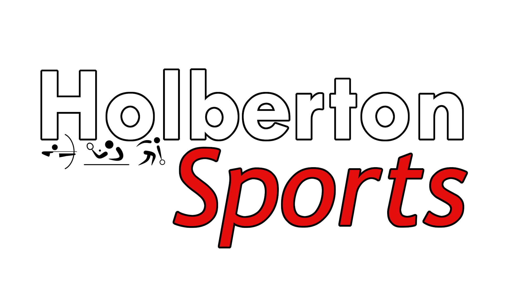

# Hoberton Sports

## What's Holberton Sports
Holberton Sports is a Virtual Reality game made on Unity. Taking inspiration from the Nintendo Wii's launch title, Wii Sports, the game will feature in its final version 3 sports:
- Bowling
- Archery
- Table Tennis

The purpose of this game is to be a pleasant way for people to discover VR and its controls. The sports in this game can be played alone or with another player (who must have their own headset).

## Download
Coming soon.

## Installation
### Meta headsets
1. Ensure the account in your headset has the "developer mode" enabled: https://developer.oculus.com/documentation/native/android/mobile-device-setup/
1. Allow content from unknown sources: https://www.meta.com/fr-fr/help/quest/articles/headsets-and-accessories/oculus-rift-s/unknown-sources/
1. Download and install the Meta Quest Developer Hub (or any sideloader): https://developer.oculus.com/documentation/unity/ts-odh/
1. Connect your headset to the computer and allow the connection in the headset.
1. Download the APK version in the [download section](#download).
1. Start the Meta Quest Developer Hub.
1. Go in "Device Manager".
1. Drag and drop the APK file in "Apps", then "Connected Device" or click on "Add Build" and look for the file.
1. Once the app is installed, click on the three dots at the end of the line of the software and then "Launch App" to start the app in the headset.
1. You can also start it directly in your headset by going in "Library", clicking on "All" at the top and then "Unknown sources".
1. Click on "Holberton Sports" to launch it.

### PCVR
1. If not already downloaded, dowload the software to link your headset to your computer. For Meta headsets: https://www.oculus.com/download_app/?id=1582076955407037
1. Download the PCVR build in the [download section](#download).
1. Extract the build from the archive.
1. Start the software making the link between the computer and the headset.
1. Run the "Holberton Sports.exe" file.

## Credits
### Menu
<a href="https://www.vecteezy.com/free-vector/stream-overlay">Stream Overlay Vectors by Vecteezy</a>
### Bowling
#### Models
- "Bowling Pack (Bowling Pins & Ball)" (https://skfb.ly/oHTtQ) by EverZax is licensed under Creative Commons Attribution (http://creativecommons.org/licenses/by/4.0/).
#### Textures
- Parquet (https://free-3dtextureshd.com/download/wood-floor-parquet-bright-texture-3d-bpr-free-download-seamless-hd-4k/)
#### Sounds
- https://www.youtube.com/watch?v=El_hlnHnxDw
### Archery
- "2020 Tokyo Olympic | Archery robin arrow" (https://skfb.ly/ouNYZ) by onlyone__o is licensed under Creative Commons Attribution (http://creativecommons.org/licenses/by/4.0/).
- "Olympic recurve bow Free 3D model" (https://www.cgtrader.com/free-3d-models/sports/equipment/olympic-recurve-bow) by IZ-MdVerz.
- "Recurve Bow" (https://skfb.ly/6URFI) by MrEliptik is licensed under Creative Commons Attribution (http://creativecommons.org/licenses/by/4.0/).
### Table Tennis
- Preview placeholder: Image from [Freepik](https://fr.freepik.com/vecteurs-libre/personnes-jouant-au-tennis-table_9978498.htm")
- "Table Tennis Table" (https://skfb.ly/6YRIC) by Diccbudd is licensed under Creative Commons Attribution (http://creativecommons.org/licenses/by/4.0/).
- "Table Tennis Rackets (Ping Pong)" (https://skfb.ly/oD8nH) by AndrewHunt95 is licensed under Creative Commons Attribution (http://creativecommons.org/licenses/by/4.0/).
### OST
- ＂Game Item Store!＂ Exciting Upbeat Game Music by HeatleyBros (https://youtu.be/q1hjI-taI2k?si=D-LnJh8lCmGVNGji)
### Others
- "Coming soon" by mohamed mahmoud hassan (https://www.publicdomainpictures.net/fr/view-image.php?image=240438&picture=arrive-bientot)
